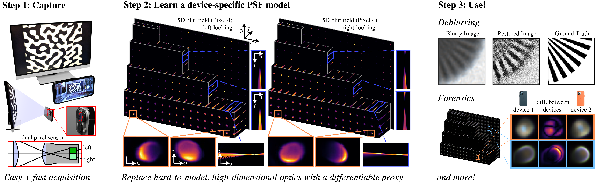

# Learning Lens Blur Fields

This repository contains the official implementation of [Learning Lens Blur Fields](https://arxiv.org/abs/2310.11535), published in IEEE TPAMI 2025. This work introduces a high-dimensional neural representation of blur—the lens blur field—and a practical method for acquiring it from real-world camera systems.




**Citation**:

```bibtex
@article{lin2025learning,
        title={Learning Lens Blur Fields},
        ISSN={1939-3539},
        url={http://dx.doi.org/10.1109/TPAMI.2025.3578587},
        DOI={10.1109/tpami.2025.3578587},
        journal={IEEE Transactions on Pattern Analysis and Machine Intelligence},
        publisher={Institute of Electrical and Electronics Engineers (IEEE)},
        author={Lin, Esther Y. H. and Wang, Zhecheng and Lin, Rebecca and Miau, Daniel and Kainz, Florian and Chen, Jiawen and Zhang, Xuaner and Lindell, David B. and Kutulakos, Kiriakos N.},
        year={2025},
        pages={1–12} }
```
